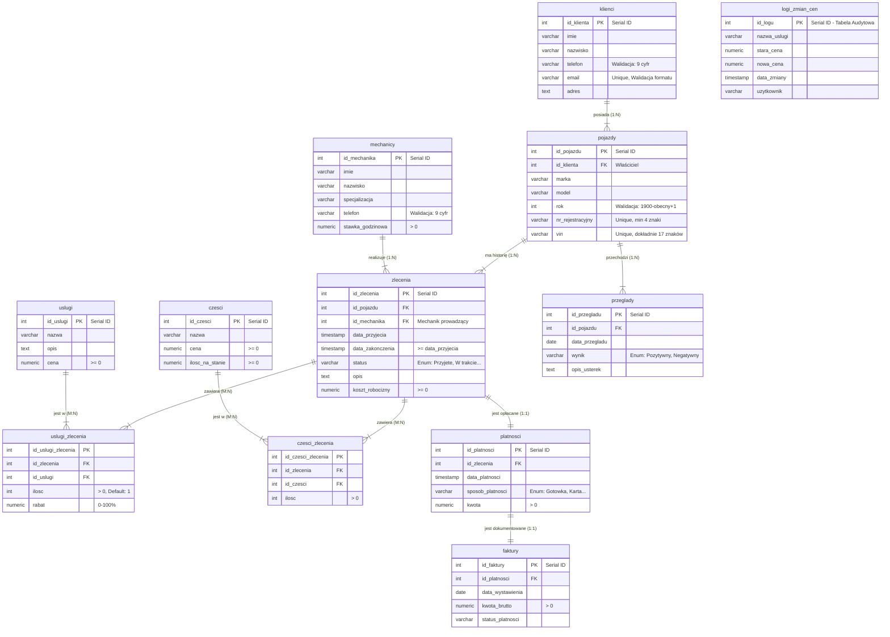

# 🚗 System Zarządzania Warsztatem Samochodowym

Projekt relacyjnej bazy danych wspierający obsługę warsztatu samochodowego. Projekt skupia się na logice biznesowej zaimplementowanej bezpośrednio po stronie serwera bazy danych

## 📋 O projekcie

Celem projektu jest usprawnienie pracy warsztatu poprzez cyfryzację kluczowych procesów. Baza danych realizuje:
* **Automatyzację magazynu:** Trigger `aktualizuj_stan_magazynu` pilnuje stanów części.
* **Logikę transakcyjną:** Procedury składowane zapewniają spójność danych (np. przy dodawaniu klienta z autem).
* **System bezpieczeństwa:** Role bazodanowe (`Kierownik`, `Recepcja`, `Mechanik`) z odpowiednimi uprawnieniami.
* **Audyt i Archiwizację:** Śledzenie zmian cen oraz archiwizacja usuwanych zleceń (Soft Delete).
* **Raportowanie:** Widoki analityczne (Ranking mechaników, Raporty finansowe).

## 📊 Schemat Bazy Danych (ERD)

## 🛠 Technologie
* **Baza danych:** PostgreSQL 16/17
* **Język:** SQL (PL/pgSQL)
* **Narzędzia:** Visual Studio Code (z wtyczką Database Client), Git

## 🚀 Instalacja i Uruchomienie

Pełna instrukcja instalacji środowiska znajduje się w pliku: 👉 **[INSTALL.md](./INSTALL.md)**

Skrypty SQL zostały podzielone na moduły. Należy je uruchomić w następującej kolejności:

1. `01_schema.sql` - Struktura tabel i walidacja danych (CHECK, REGEX).
2. `02_constraints.sql` - Relacje (klucze obce)
3. `03_views.sql` - Widoki
4. `04_logic.sql` - Triggery i Procedury Składowane
5. `05_security.sql` - Role i uprawnienia
6. `06_seed_data.sql` - Dane testowe
7. `07_indexes.sql` - Optymalizacja wydajności
8. `08_archivization.sql` - Mechanizmy archiwizacji

## 💡 Kluczowe funkcjonalności:

### 1. Automatyzacja Magazynu
System automatycznie zdejmuje części ze stanu w momencie przypisania ich do zlecenia. Próba pobrania większej ilości niż dostępna kończy się błędem `RAISE EXCEPTION`.

### 2. Bezpieczeństwo Danych
* **Walidacja**: Numery VIN (17 znaków), telefony (format), daty i ceny są sprawdzane na poziomie tabeli.
* **Role**:
- `rola_kierownik`: Pełny dostęp
- `rola_mechanik`: Widzi zlecenia, nie widzi danych finansowych ani klientów
- `rola_recepcja`: Zarządza klientami i fakturami

### 3. Audyt (logi)
Każda zmiana w cenniku usług jest odnotowywana w tabeli `logi_zmian_cen` wraz z informacją, kto i kiedy dokonał zmiany.

---
*Projekt wykonany w ramach przedmiotu Bazy Danych. Autorzy: Kamil Szkarłat, Maciej Popławski*
